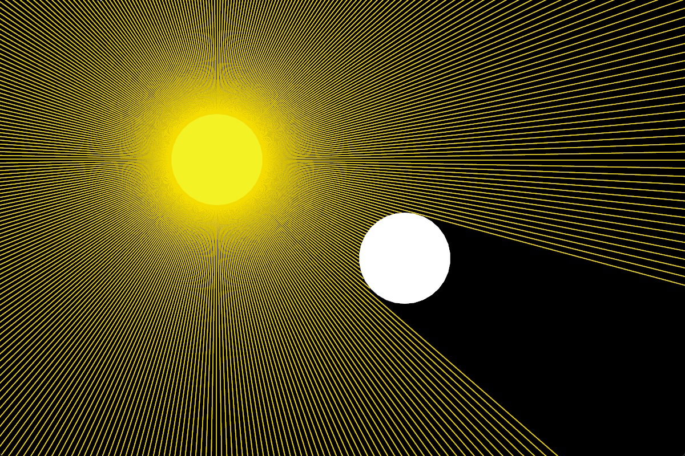

# Ray Tracing

A basic 2D ray tracing application made in C++

## How it works

The simulation calculates which beams are going to hit the target using math equations. Then, it calculates the exact point where the beam is going to hit and adjusts the beam size accordingly.

## Screenshots

## Acknowledgements

- [SFML](https://github.com/SFML/SFML)

## License

[MIT](LICENSE)
